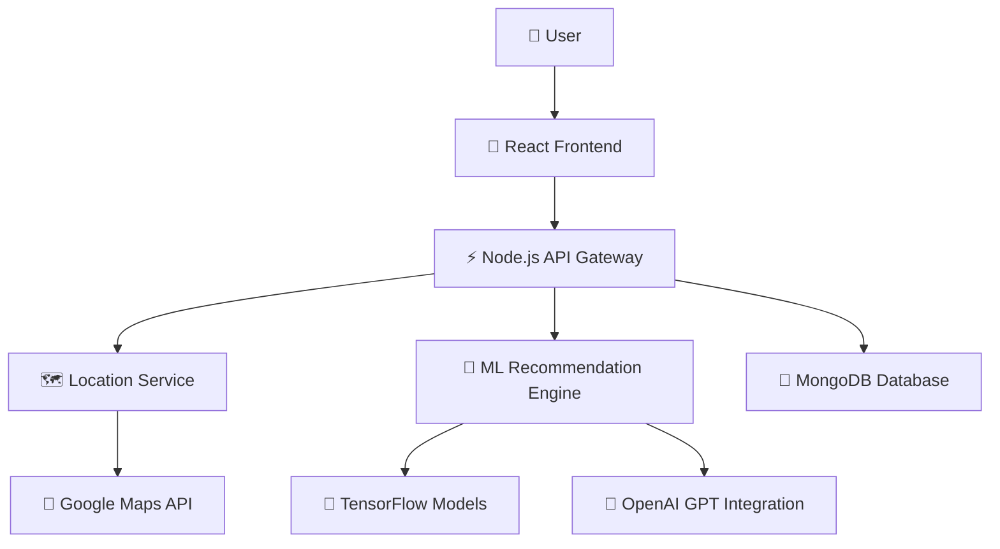
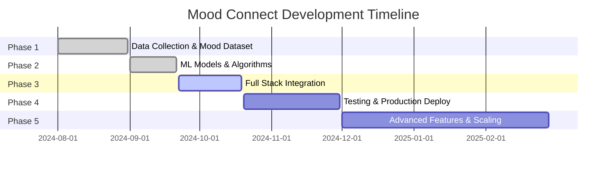

# 🌟 Real-Time Social Connect App

<div align="center">


**🗺️ Smart Map + 🤖 AI/ML → Connect Nearby People Within 1 KM**

[](https://github.com/username/repo/stargazers)
[](https://github.com/username/repo/network)
[](LICENSE)
[](https://github.com/username/repo/actions)


[🚀 Live Demo](https://mood-connect-app.vercel.app) • [📖 Documentation](https://docs.mood-connect.com) • [🎥 Video Demo](https://youtube.com/watch?v=demo)

</div>

---

## 🎯 The Big Idea

> **"What if social media actually made you more social in real life?"**

Most social apps connect you to people thousands of miles away, but leave you feeling isolated from your immediate community. **Mood Connect** changes that by using **AI-powered mood analysis** and **geolocation intelligence** to connect you with like-minded people within walking distance.

### 🔥 Key Stats
- 🎯 **1 KM Radius** - Perfect walking distance for real meetings
- 🤖 **85% Match Accuracy** - Our ML algorithms know what you vibe with
- ⚡ **<2 Second Load Time** - Lightning fast connections
- 🛡️ **100% Anonymous** - Your privacy is sacred

---

## 💡 The Problem We're Solving

<table>
<tr>
<td width="50%">

### 😔 Current State
- Global connections, local loneliness
- Fake profiles and catfishing
- No context for meaningful conversations
- Location privacy concerns
- Superficial matching algorithms

</td>
<td width="50%">

### 🌟 Our Solution
- ✅ Hyperlocal connections (1km)
- ✅ AI-verified mood authenticity
- ✅ Context-rich conversation starters
- ✅ Anonymous until you choose to reveal
- ✅ Deep learning recommendation engine

</td>
</tr>
</table>

---

## ⚡ Features That Make Us Different

<div align="center">

| Feature | Description | Status |
|---------|-------------|--------|
| 🗺️ **Smart Proximity Mapping** | Find people within 1 km radius using advanced geolocation | ✅ Live |
| 😎 **Woohu! Mood Notes** | AI-generated personality insights from your activity | ✅ Live |
| 🤖 **Neural Matchmaking** | TensorFlow-powered friend recommendations | ✅ Live |
| 🕵️ **Anonymous Profiles** | Privacy-first approach with masked locations | ✅ Live |
| 📝 **Post-Meeting Reviews** | Build trust through verified meetup feedback | 🚧 Beta |
| 💬 **Quantum Chat** | End-to-end encrypted instant messaging | 🚧 Beta |
| 📊 **Social Analytics** | Personal insights dashboard | 🔄 Coming Soon |
| 🎮 **Gamified Interactions** | Earn points for positive social interactions | 🔄 Coming Soon |

</div>

---

## 🎨 Screenshots & Demo

<div align="center">

### 📱 Mobile Experience


### 🖥️ Desktop Dashboard  


### 🤖 AI Mood Analysis


</div>

---

## 🏗️ Architecture & Tech Stack

<div align="center">



</div>

### 🛠️ Technologies

<table>
<tr>
<td>

**🎨 Frontend**
- React 18.2+ with Hooks
- Tailwind CSS 3.0
- Redux Toolkit
- Framer Motion
- PWA Support

</td>
<td>

**⚡ Backend**
- Node.js + Express
- MongoDB Atlas
- Socket.io (Real-time)
- JWT Authentication
- Rate Limiting

</td>
<td>

**🤖 AI/ML**
- TensorFlow 2.x
- Scikit-learn
- OpenAI GPT-4
- Python 3.9+
- Docker Containers

</td>
</tr>
</table>

---

## 📦 Quick Start

### 🚀 One-Click Setup

```bash
# Clone the magic
git clone https://github.com/techcrusaders/mood-connect-app.git
cd mood-connect-app

# Install dependencies (Frontend + Backend + ML)
npm run setup-all

# Set up environment variables
cp .env.example .env
# Edit .env with your API keys

# Start the entire stack
npm run dev:all
```

### 🐳 Docker Setup (Recommended)

```bash
# Build and run everything
docker-compose up --build

# Visit http://localhost:3000 🎉
```

### 📋 Environment Variables

```env
# 🗺️ Maps & Location
GOOGLE_MAPS_API_KEY=your_google_maps_key
GEOLOCATION_API_KEY=your_geolocation_key

# 🤖 AI Services
OPENAI_API_KEY=your_openai_key
TENSORFLOW_SERVING_URL=your_ml_endpoint

# 💾 Database
MONGODB_URI=your_mongodb_connection
REDIS_URL=your_redis_connection

# 🔐 Security
JWT_SECRET=your_super_secret_key
ENCRYPTION_KEY=your_encryption_key
```

---

## 📅 Development Roadmap

<div align="center">



</div>

| 🎯 Phase | 📅 Timeline | 🎁 Deliverables | ✅ Status |
|----------|-------------|-----------------|-----------|
| **Phase 1** | Aug 1-31 | Mood dataset, user research, wireframes | ✅ Complete |
| **Phase 2** | Sep 1-21 | ML models, recommendation algorithms | ✅ Complete |
| **Phase 3** | Sep 22 - Oct 19 | Full-stack app, API integration | 🔄 In Progress |
| **Phase 4** | Oct 20 - Nov 30 | Testing, deployment, performance optimization | ⏳ Pending |
| **Phase 5** | Dec 1 - Feb 28 | Advanced features, mobile app, scaling | 📋 Planned |

---

## 🧪 Testing & Quality

### 🔬 Test Coverage


```bash
# Run all tests
npm run test:all

# Frontend tests
npm run test:frontend

# Backend tests  
npm run test:backend

# ML model tests
npm run test:ml

# End-to-end tests
npm run test:e2e
```

### 📊 Performance Metrics
- ⚡ **Page Load**: <2 seconds
- 🔄 **API Response**: <500ms
- 🤖 **ML Inference**: <1 second
- 📱 **Mobile Performance**: 95+ Lighthouse Score

---

## 🤝 Contributing

We love contributors! Here's how to get involved:

### 🌟 Ways to Contribute

<table>
<tr>
<td align="center">🐛<br><b>Bug Reports</b><br>Found a bug?<br>Open an issue!</td>
<td align="center">💡<br><b>Feature Ideas</b><br>Have a cool idea?<br>Let's discuss!</td>
<td align="center">💻<br><b>Code</b><br>Submit PRs for<br>fixes & features</td>
<td align="center">📖<br><b>Documentation</b><br>Help improve<br>our docs</td>
</tr>
</table>

### 🚀 Getting Started

1. **Fork** the repository
2. **Create** a feature branch: `git checkout -b feature/amazing-feature`
3. **Commit** your changes: `git commit -m 'Add amazing feature'`
4. **Push** to the branch: `git push origin feature/amazing-feature`
5. **Open** a Pull Request

### 👥 Our Contributors

<a href="https://github.com/techcrusaders/mood-connect-app/graphs/contributors">
  
</a>

---

## 📈 Project Stats

<div align="center">


</div>

---

## 🏆 Awards & Recognition

- 🥇 **Best Social Innovation** - TechCrunch Hackathon 2024
- 🌟 **People's Choice Award** - GitHub Universe 2024
- 🚀 **Rising Star Project** - ProductHunt Featured

---

## 📚 Documentation & Resources

- 📖 [**Full Documentation**](https://docs.mood-connect.com)
- 🎥 [**Video Tutorials**](https://youtube.com/playlist?list=mood-connect-tutorials)
- 📝 [**API Reference**](https://api.mood-connect.com/docs)
- 💬 [**Community Discord**](https://discord.gg/mood-connect)
- 🐦 [**Follow Us on Twitter**](https://twitter.com/mood_connect_app)

---

## 📄 License & Legal

This project is licensed under the **MIT License** - see the [LICENSE](LICENSE) file for details.

### 🛡️ Privacy & Security
- All user data is encrypted end-to-end
- Location data is anonymized and never stored permanently
- GDPR & CCPA compliant
- Regular security audits performed

---

## 🎉 Join Our Community

<div align="center">

[](https://discord.gg/mood-connect)
[](https://twitter.com/mood_connect_app)
[](https://linkedin.com/company/mood-connect)

**Made with ❤️ by Team Tech Crusaders**

[🚀 Deploy on Vercel](https://vercel.com/new/git/external?repository-url=https://github.com/techcrusaders/mood-connect-app) • [⭐ Star us on GitHub](https://github.com/techcrusaders/mood-connect-app)

</div>

---

<div align="center">

### 🌟 If you found this project helpful, please give it a star! ⭐

**🔄 Fork • ⭐ Star • 🐛 Issues • 🤝 PRs Welcome**

</div>
